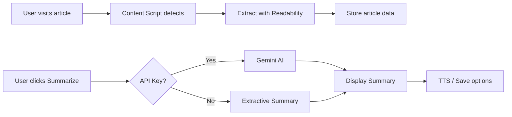

# 🤖 AI Reading Assistant

<div align="center">

**Smart Chrome extension that uses AI to summarize articles, extract key points, and enhance your reading experience**

*Developed for NEVERHACK Hackathon 2025*

[](https://developer.chrome.com/docs/extensions/mv3/intro/)
[](https://opensource.org/licenses/MIT)
[](https://ai.google.dev/)

</div>

---

## 🎯 Problem & Solution

**The Problem**: Information overload. Too many long articles, not enough time to read them all.

**Our Solution**: AI Reading Assistant analyzes articles and provides instant, intelligent summaries powered by Google Gemini AI.

## ✨ Features

### 🤖 AI-Powered Summarization
- **Gemini AI Integration**: Uses Google's Gemini 1.5 Flash for high-quality summaries
- **Multiple Lengths**: Choose short, medium, or long summaries
- **Fallback Mode**: Extractive summarization works without API key

### 📝 Smart Content Extraction
- Automatically detects articles on web pages
- Extracts clean text using Mozilla Readability
- Gets metadata (title, author, word count, read time)

### 💡 Key Points Extraction
- Automatically extracts 3-5 key takeaways
- Bullet-point format for quick scanning
- Perfect for busy readers

### 🌍 Smart Language Detection
- Automatically detects article language (French/English)
- Generates summaries in the same language as the content
- No manual configuration needed

### 🎧 Text-to-Speech
- Listen to summaries while multitasking
- Built-in browser TTS (no external dependencies)
- Play/pause controls

### 💾 Save & Organize
- Save your favorite summaries for later
- Persistent local storage
- Quick access to reading history

### 🎨 Beautiful UI
- Clean, reading-focused design
- Professional typography (Inter + Merriweather)
- Smooth animations and transitions

## 🚀 Installation

### Option 1: Load Unpacked (Developer Mode)

1. **Download the extension**
   ```bash
   git clone https://github.com/votre-username/ai-reading-assistant.git
   cd ai-reading-assistant
   ```

2. **Open Chrome Extensions**
   - Navigate to `chrome://extensions/`
   - Enable **Developer mode** (toggle in top right)

3. **Load Extension**
   - Click **Load unpacked**
   - Select the `extension chrome` folder

4. **Configure API Key (Optional but Recommended)**
   - Click extension icon → Settings
   - Get free API key from [Google AI Studio](https://makersuite.google.com/app/apikey)
   - Paste and save

### Option 2: Chrome Web Store
*Coming soon after hackathon review*

## 💻 Usage

1. **Navigate to an article** (news, blog, Wikipedia, etc.)
2. **Click the extension icon** 📖
3. **Click "Summarize"** to generate AI summary
4. **Optional actions**:
   - 🎧 Click "Listen" for text-to-speech
   - 💾 Click "Save" to store summary
   - ⚙️ Access settings to configure preferences

## 🔑 API Key Setup

### Get Free Gemini API Key

1. Visit [Google AI Studio](https://makersuite.google.com/app/apikey)
2. Sign in with Google account
3. Click "Create API Key"
4. Copy the key

### Configure Extension

1. Click extension icon → ⚙️ Settings
2. Paste API key in "Gemini API Key" field
3. Click "Save API Key"

**Free Tier Limits**:
- 15 requests per minute
- 1,500 requests per day
- Perfect for personal use!

**No API Key?** The extension still works with extractive summarization (no AI).

## 🏗️ Technical Architecture

### Tech Stack
- **Manifest V3** (latest Chrome extension standard)
- **Gemini AI API** (Google's generative AI)
- **Mozilla Readability** (article extraction)
- **Web Speech API** (text-to-speech)
- **Vanilla JavaScript** (no frameworks)

### File Structure
```
extension chrome/
├── manifest.json          # Extension configuration
├── background.js          # Service worker
├── content.js             # Article extraction
├── popup.html/css/js      # Main UI
├── options.html/js        # Settings page
├── api.js                 # Gemini API wrapper
├── summarizer.js          # Extractive fallback
├── libs/
│   └── readability.js     # Mozilla Readability
└── icons/                 # Extension icons
```

### How It Works



## 🔒 Sécurité & Confidentialité

**Engagement de respect de la vie privée :**

✅ **Permissions minimales** : uniquement `activeTab`, `storage`, `scripting`
✅ **Aucune collecte de données** : tout reste local dans votre navigateur
✅ **Traitement transparent** : le texte est envoyé à Gemini AI uniquement quand vous cliquez sur "Summarize"
✅ **Stockage local** : vos résumés sont sauvegardés localement avec chrome.storage
✅ **Pas de tracking** : aucune analytique, aucun serveur tiers
✅ **Code open source** : auditable par tous

**Données traitées :**
- Texte de l'article : envoyé à Gemini AI pour génération du résumé (si API activée)
- Résumés sauvegardés : stockés localement dans votre navigateur
- Clé API : stockée localement, jamais transmise ailleurs qu'à Google AI

## 🎨 Screenshots

*Coming soon - Load extension to see it in action!*

## 🛠️ Development

### Prerequisites
- Chrome or Chromium-based browser
- Text editor (VS Code recommended)
- Git

### Local Development

1. **Clone repository**
   ```bash
   git clone <repo-url>
   cd extension chrome
   ```

2. **Load in Chrome**
   - Go to `chrome://extensions/`
   - Enable Developer mode
   - Load unpacked

3. **Make changes**
   - Edit files
   - Click reload button in `chrome://extensions/`

### Debug

- **Background Script**: Click "Service worker" in extensions page
- **Popup**: Right-click popup → Inspect
- **Content Script**: F12 on any webpage

## 🤝 Contributing

Contributions welcome! Please:

1. Fork the repository
2. Create feature branch (`git checkout -b feature/AmazingFeature`)
3. Commit changes (`git commit -m 'Add: Amazing Feature'`)
4. Push to branch (`git push origin feature/AmazingFeature`)
5. Open Pull Request

## 📜 License

This project is licensed under the **MIT License** - see [LICENSE](LICENSE) file.

## 🏆 NEVERHACK Hackathon 2025

This extension was created for the **"La Ligue des Extensions"** challenge at NEVERHACK Hackathon.

**Requirements Met**:
- ✅ Manifest V3 Chrome extension
- ✅ Solves real problem (information overload)
- ✅ Open source on GitHub
- ✅ Clean code and documentation
- ✅ Innovative use of AI technology
- ✅ **Développement Sécurisé** (theme):
  - Permissions minimales
  - Aucune collecte de données personnelles
  - Stockage local uniquement
  - Code open source auditable
  - Traitement transparent des données

## 🙏 Acknowledgments

- **NEVERHACK** for organizing the hackathon
- **Google** for Gemini AI API
- **Mozilla** for Readability library
- Open source community

## 📞 Support

Found a bug? Have a feature request?
- Open an [Issue](https://github.com/votre-username/ai-reading-assistant/issues)
- Or contact: your-email@example.com

---

<div align="center">

**Made with 🤖 for smarter reading**

[Documentation](README.md) • [Report Bug](issues) • [Request Feature](issues)

</div>
